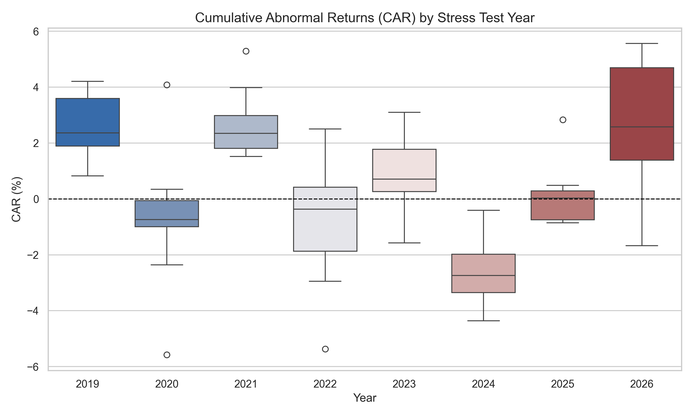
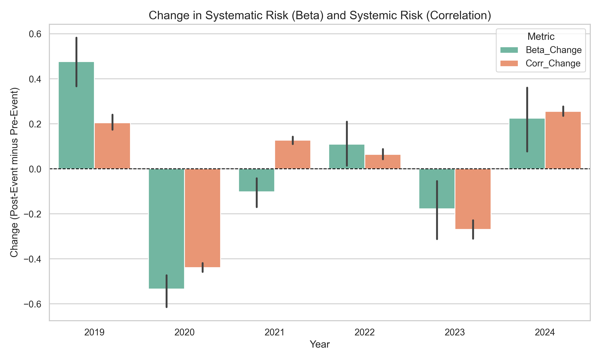

# 🏦 Banking Stress Test & Market Risk Analysis


## 📌 Project Overview
Regulatory stress tests are designed to evaluate the resilience of major financial institutions under adverse economic scenarios. But how does the market react to these tests? 

This project explores the **market impact of banking stress tests** by utilizing quantitative finance techniques. It features a complete pipeline to fetch historical market data, perform event studies, and analyze changes in both systematic and systemic risks. 

Whether you are a financial analyst, data scientist, or quantitative researcher, this repository provides a robust framework for assessing regulatory market impacts.

## 🚀 Key Features

* **Data Aggregation (`fetch_data.py`)**: Automates the retrieval of historical banking data and market indices.
* **Event Study Methodology (`event_study.py`)**: Calculates Cumulative Abnormal Returns (CAR) to measure the immediate market reaction around the stress test announcement dates.
* **Risk Analytics (`risk_analysis.py`)**: Computes pre- and post-event changes in:
  * **Systematic Risk (Beta)**: The bank's volatility relative to the broader market.
  * **Systemic Risk (Correlation)**: The interconnectedness of bank returns, indicating broader sector vulnerability.
* **Automated Reporting (`generate_report.py`)**: Generates high-quality, publication-ready visualizations using `Seaborn` and `Matplotlib`.

## 📊 Visual Highlights

### 1. Market Reaction: Cumulative Abnormal Returns (CAR)
This boxplot illustrates the distribution of Cumulative Abnormal Returns for banks across different stress test years. It highlights whether the announcements generally triggered positive or negative abnormal market movements.



### 2. Risk Dynamics: Systematic vs. Systemic Risk
The bar plot below details how risk metrics shifted following the stress test events. It contrasts changes in Systematic Risk (Beta) against Systemic Risk (Correlation).



## 🛠️ Setup & Execution

### Prerequisites
Make sure you have Python installed, then set up your environment:
```bash
git clone https://github.com/creeedd89/banking-stress-test.git
cd banking-stress-test
pip install -r requirements.txt
```

### Running the Pipeline
Execute the modules in the following order to replicate the analysis:
1. `python fetch_data.py` - Retrieves necessary financial datasets.
2. `python event_study.py` - Computes the abnormal returns around event windows.
3. `python risk_analysis.py` - Evaluates the shift in risk metrics.
4. `python generate_report.py` - Compiles the results into visualizations.

## 🤝 Let's Connect!
I built this project to deepen my understanding of quantitative finance and data science. If you found this interesting, have suggestions, or want to discuss financial modeling, feel free to connect with me!
